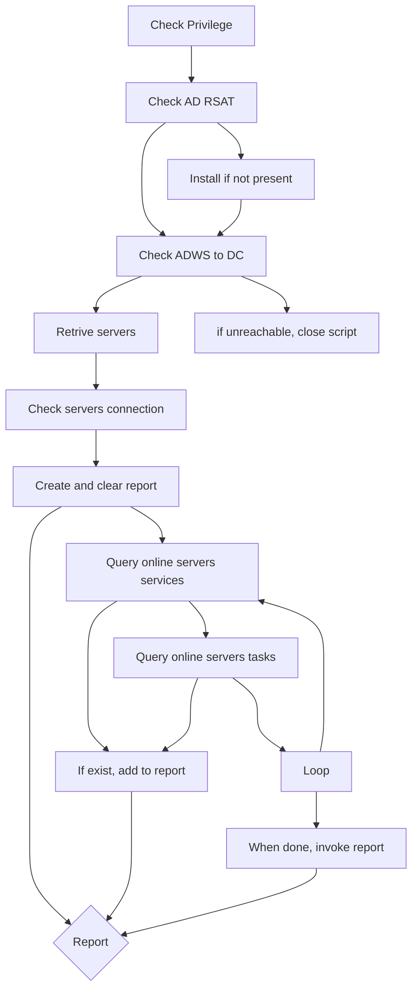

# SAF - Service Account Finder

This PowerShell script fetch servers on Active Directory and remotely check service and scheduled task for any uncommon accounts. The goal of this script is to make a html report to help system administrators to find any  where service accounts are use in their Windows server infrastructure.

## Disclaimer 
This script is provided as-is without any warranties. Use it at your own risk.

## Prerequisites
- PowerShell execution policy allows running scripts
- Run PowerShell with administrative privileges
- Domain Administrator access
- RSAT: Active Directory Domain Services and Lightweight Directory Services Tools
- Active Directory Web Services (ADWS) access to servers
- Windows Remote Management (WinRM) access to servers

## Script workflow

