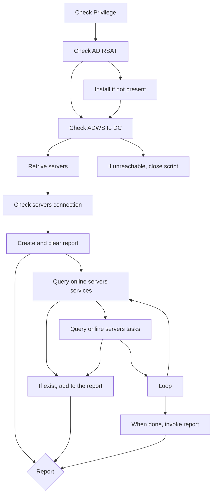

# SAF - Service Account Finder

This PowerShell script fetch servers on Active Directory  and remotely examines services and scheduled tasks for any unusual accounts. The objective of this script is to generate an HTML report that assists system administrators in identifying instances where service accounts are employed within their Windows server infrastructure.

## Disclaimer 
This script is provided as-is without any warranties. Use it at your own risk.

## Prerequisites
- PowerShell execution policy allows running scripts
- Run PowerShell with administrative privileges
- Domain Administrator access
- RSAT: Active Directory Domain Services and Lightweight Directory Services Tools
- Active Directory Web Services (ADWS) access to servers
- Windows Remote Management (WinRM) access to servers

## Script workflow

